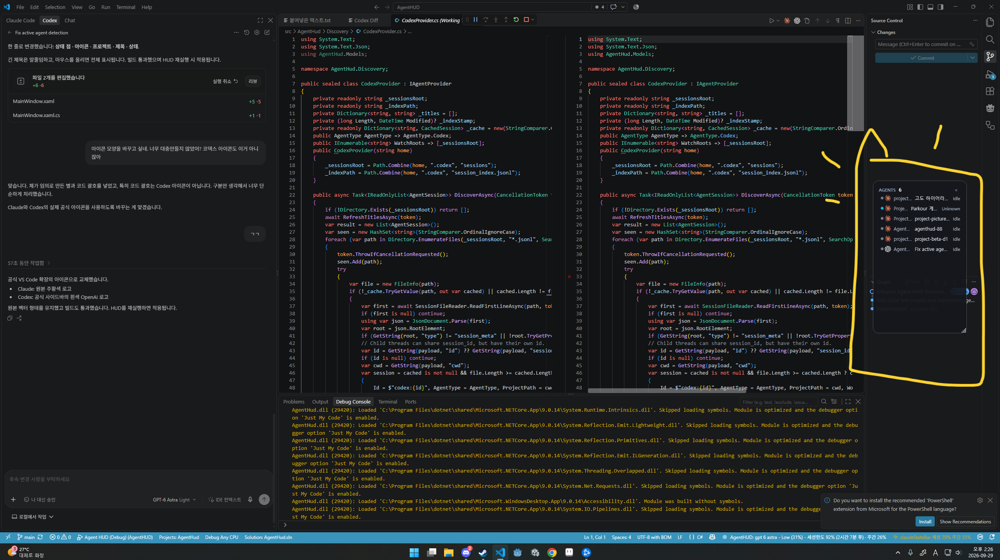
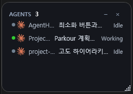
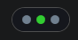
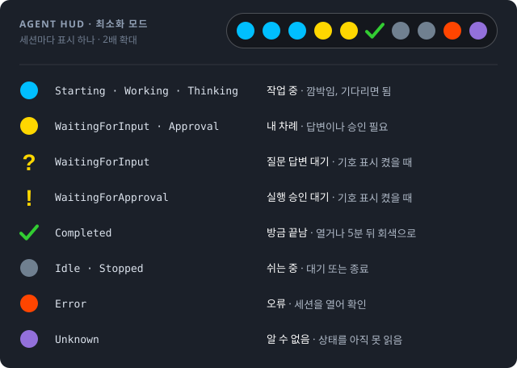
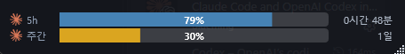
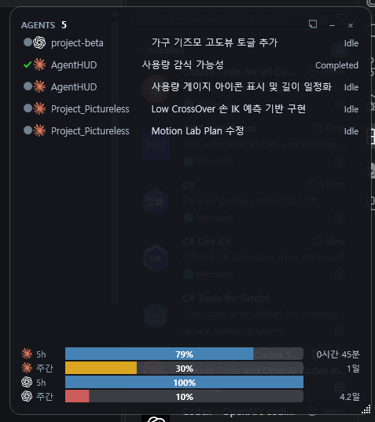

# Agent HUD

여러 프로젝트에서 Claude Code나 Codex를 동시에 돌리다 보면 어느 창에서 어떤 에이전트가 일하고 있는지, 무엇이 끝나서 내 입력을 기다리는지 놓치기 쉽습니다. Agent HUD는 화면 한쪽에 항상 떠 있는 작은 패널로, 지금 PC에서 실행 중인 에이전트 세션을 프로젝트별로 자동으로 모아 상태와 함께 보여 줍니다. 따로 등록할 필요 없이 켜 두기만 하면 되고, 목록에서 세션을 더블클릭하면 해당 프로젝트의 VS Code 창과 대화로 바로 이동합니다.



| 기본 패널 | 최소화 |
| --- | --- |
|  |  |

헤더의 `–` 버튼을 누르면 세션마다 상태 점 하나만 남는 작은 바로 줄어듭니다. 점에 마우스를 올리면 프로젝트와 상태가 보이고, 바를 드래그해 옮기거나 더블클릭해 원래 크기로 되돌릴 수 있습니다.



`?`/`!` 기호는 HUD 우클릭 → **설정... → 대기 상태를 기호로 표시**를 켰을 때만 나오며, 끄면 두 대기 상태 모두 노란 점입니다.

## 현재 MVP

- 실제 Claude `~/.claude/sessions/*.json` 메타데이터(PID, sessionId, cwd, status)를 읽고 프로세스 생존 여부와 결합
- 실제 Codex `~/.codex/sessions/**/rollout-*.jsonl`의 `session_meta`(session_id, cwd)를 읽고 파일 활동 시각과 결합
- provider → discovery service → thread-safe registry → HUD 분리
- Codex 내부 guardian 세션과 대화 기록이 없는 Claude VS Code의 Idle 대기 세션은 목록에서 제외 (실제 대화·작업 서브에이전트는 유지)
- `FileSystemWatcher` 이벤트 + 3초 저비용 보정 polling
- 프로젝트/Git worktree 식별, 안정적인 provider session ID, 종료 세션의 짧은 표시
- borderless/topmost/taskbar-hidden HUD, 위치 저장, 헤더·빈 영역 더블클릭 확장
- 세션 항목 더블클릭 시 해당 프로젝트(Git 루트, 없으면 cwd)를 VS Code로 열고 확장 URI(`anthropic.claude-code/open?session=`, `openai.chatgpt/local/`)로 대화 탭 열기 (사이드바 대화는 전환 불가, [조사 기록](docs/vscode-session-open.md))
- 헤더 `–` 버튼으로 상태 점만 가로로 표시하는 최소화 모드 (오른쪽 끝 고정, 더블클릭 복원)
- `PinWindow`으로 HUD 창을 모든 Windows 가상 데스크톱에 표시
- 세션에 마우스를 올리면 나오는 `×`로 상태와 관계없이 HUD에서 숨기기. 숨긴 세션은 새로 입력·승인 대기나 완료 상태가 되면 다시 표시되고, HUD 우클릭 → **숨긴 세션 다시 표시**로 한 번에 복원 (숨김 기록은 재시작 시 초기화)
- 헤더 메모 버튼으로 자유 메모장, 세션 우클릭 → **프로젝트 메모...**로 프로젝트별 메모 (메모가 있는 프로젝트는 이름 옆 아이콘 표시, 아이콘 클릭으로 열기, `%LOCALAPPDATA%\AgentHud\memos.json`에 저장)
- 사용량 게이지: 창 아래쪽에 감지된 LLM의 5시간·주간 남은 사용량을 막대와 리셋까지 남은 시간으로 표시 ([사용량 게이지](#사용량-게이지))
- 사용량 한도 감지: Claude(대화 로그의 `rate_limit` API 오류)와 Codex(`task_complete`의 `usage_limit_exceeded`)가 한도로 멈추면 분홍 점(`RateLimited`)과 리셋 시각 툴팁을 표시하고, 리셋 시각이 되면 화면 오른쪽 아래에 소리와 함께 알림을 띄움(클릭 시 대화 열기, 설정에서 끄기 가능). HUD 우클릭 → **설정... → 사용량 한도 리셋 후 자동으로 이어서 진행**을 켜면 리셋 1분 뒤 해당 대화를 CLI로 한 번 이어 실행 ([자동 재개](#사용량-한도-자동-재개))

## 요구 사항

### 실행 환경

- **Windows 11**: 동봉된 `VirtualDesktopAccessor.dll`은 Windows 11용 빌드(`2024-12-16-windows11`)입니다. Windows 10에서도 HUD는 동작하지만 가상 데스크톱 고정이 실패하고 활성 창 추적 방식으로 대체됩니다.
- **.NET 9 SDK** (빌드·`dotnet run`용). 빌드된 실행 파일만 쓸 때는 **.NET 9 Desktop Runtime**으로 충분합니다.
- 감시 대상 에이전트: **Claude Code**(`~/.claude/sessions`)와 **Codex**(`~/.codex/sessions`). 둘 중 하나만 써도 되며, 폴더가 없으면 해당 provider는 비어 있습니다.
- Git은 설치하지 않아도 됩니다. 프로젝트 식별은 `.git` 폴더/파일을 직접 찾습니다.

### VS Code 연동 (세션 더블클릭)

세션 항목을 더블클릭해 VS Code로 이동하려면 다음이 모두 필요합니다. 없어도 HUD 표시에는 영향이 없습니다.

| 항목 | 필요한 이유 | 확인 방법 |
| --- | --- | --- |
| **VS Code Stable** | `vscode://` URI를 사용합니다. Insiders(`vscode-insiders://`)와 VSCodium 등 포크는 지원하지 않습니다. | — |
| **`code` 명령이 PATH에 등록** | 프로젝트 창을 먼저 앞으로 가져오는 데 사용합니다. 없으면 `vscode://file/` URI로 대체되지만, 이미 열린 창 전환이 덜 정확합니다. | `code --version` (설치 시 "PATH에 추가" 옵션 또는 명령 팔레트 **Shell Command: Install 'code' command in PATH**) |
| **`vscode://` 프로토콜 등록** | 대화 URI를 VS Code로 전달합니다. 일반 설치 시 자동 등록됩니다. | `HKCU\Software\Classes\vscode\shell\open\command` 존재 |
| **Claude Code 확장** (`anthropic.claude-code`) | Claude 세션 대화 탭 열기(`/open?session=`). 2.1.284에서 확인했습니다. | `code --list-extensions` |
| **Codex 확장** (`openai.chatgpt`) | Codex 세션 대화 열기(`/local/<id>`). 26.917.62051에서 확인했으나 실제 대화 전환은 미검증입니다. | `code --list-extensions` |
| **Claude 확장의 Preferred Location = editor** (권장) | 확장이 외부에서 사이드바 대화를 전환하는 방법을 제공하지 않아, 대화 전환은 에디터 탭에서만 됩니다. 사이드바를 쓰면 창 이동만 됩니다. | 설정 `claudeCode.preferredLocation` |

VS Code가 꺼져 있으면 확장이 준비되기 전에 URI가 도착해 대화가 열리지 않을 수 있습니다. 한 번 더 더블클릭하면 됩니다. 자세한 내용은 [조사 기록](docs/vscode-session-open.md)을 참고하세요.

### 개발 환경 (VS Code에서 빌드·디버그)

- **C# Dev Kit** (`ms-dotnettools.csdevkit`, 저장소 권장 확장): 함께 설치되는 **C#** 확장(`ms-dotnettools.csharp`)이 `F5`의 `coreclr` 디버거를 제공합니다. C# Dev Kit 라이선스 조건(Visual Studio Community 조건과 동일)을 확인하세요.
- **.NET 9 SDK**: `build`/`run registry checks` 작업이 `dotnet`을 호출합니다.
- **Windows PowerShell 5.1** 이상: `verify VirtualDesktopAccessor` 작업과 `scripts/update-vda.ps1`에 사용합니다.

## 실행

빌드된 파일은 [Releases](https://github.com/garunnir/AgentHUD/releases)에서 받을 수 있습니다. `win-x64.zip`은 .NET 9 Desktop Runtime이 필요하고, `win-x64-self-contained.zip`은 런타임이 포함되어 있습니다. `v*` 태그를 push하면 GitHub Actions가 두 파일을 빌드해 릴리스를 만듭니다.

소스에서 실행하려면:

```powershell
dotnet run --project src/AgentHud/AgentHud.csproj
```

VS Code에서는 저장소 폴더를 연 뒤 `F5`를 누르고 **Agent HUD (Debug)** 구성을 선택하면 됩니다. `Ctrl+Shift+B`는 Debug 빌드를 실행하며, 명령 팔레트의 **Tasks: Run Test Task**는 Registry 검사를 실행합니다.

현재 저장소는 설치된 SDK에 맞춰 `net9.0-windows`를 사용합니다. .NET 10 SDK 설치 후 두 `.csproj`의 TargetFramework를 `net10.0-windows`로 변경하면 됩니다.

## 검증

```powershell
dotnet build AgentHud.sln
dotnet run --project tests/AgentHud.Tests/AgentHud.Tests.csproj
```

Codex는 파일 크기와 수정 시각으로 변경을 감지하고, 변경된 로그의 마지막 256KB에서 이벤트 시각과 상태를 읽습니다. Windows에서 파일 수정 시각이 갱신되지 않아도 크기가 증가하면 반영됩니다. `task_started`는 Working, reasoning은 Thinking, `task_complete`는 Idle, `turn_aborted`는 Stopped로 표시합니다. 스레드별 PID 연결은 아직 없으므로 최근 이벤트가 활성 유지 시간(기본 5분, HUD 우클릭 → 설정...에서 1–1440분으로 변경) 이내인 세션을 활성으로 추정합니다. 장시간 이벤트가 없는 작업이나 대기 세션의 생존 여부는 확정하지 못합니다. Claude/Codex 내부 포맷이 바뀌면 provider만 수정하면 됩니다.

가상 데스크톱 고정에는 MIT 라이선스의 `VirtualDesktopAccessor.dll`을 사용합니다. 창 표시 후 고정하고 5초마다 재확인합니다. 고정 API가 실패하면 Windows의 `IVirtualDesktopManager`로 현재 활성 창의 데스크톱을 확인해 HUD를 이동합니다(250ms 간격). 전환한 데스크톱에 활성 창이 없으면 창을 활성화할 때까지 이동이 지연될 수 있습니다.

GitHub Actions는 push/PR마다 DLL 무결성 검사와 Release 빌드, Registry 검사를 수행합니다. 매주 월요일에는 VirtualDesktopAccessor의 최신 안정 릴리스를 확인하고 변경이 있으면 `deps/virtualdesktopaccessor` PR을 자동 생성합니다.

상태 색상: 파랑은 작업/추론 중, 노랑은 사용자 응답/승인 필요, 회색은 Idle(다음 지시 대기)/중단, 빨강은 오류, 초록 체크(✓)는 미확인 완료, 보라색은 Unknown(상태 정보 없음 또는 인식 불가)입니다. 시작/작업/추론 중에는 파란색 점이 은은하게 맥동합니다.

HUD 실행 중 작업/추론/승인 대기에서 Idle 또는 Completed로 바뀌면 완료 알림을 표시합니다. 미확인 완료는 일반·최소화 화면에서 초록색 체크로 유지되며, 완료 감지 후 최대 5분 동안 세션이 사라져도 목록에 남습니다. 5분이 지나면 완료 표시를 해제하고 Idle로 돌아갑니다(비활성 세션은 기존 규칙에 따라 목록에서 정리됩니다). 세션을 더블클릭해 열면 확인 처리합니다. 새 명령으로 시작/작업/추론 상태가 되면 이전 완료 표시가 해제되고 현재 상태를 표시하며, 그 작업이 끝나면 다시 초록색 체크로 표시합니다. 완료 확인 기록은 HUD를 종료하면 초기화됩니다.

## 기여

버그 제보와 PR을 환영합니다. [CONTRIBUTING.md](CONTRIBUTING.md)를 참고해 주세요.

질문·승인 대기는 기본적으로 일반·최소화 화면에서 노란색 원으로 표시합니다. HUD 우클릭 → 설정... → 대기 상태를 기호로 표시 (? / !)를 켜면 질문은 물음표(?), 승인은 느낌표(!)로 전환됩니다. 설정은 즉시 반영되며 재시작 후에도 유지됩니다. Codex는 동기 질문 도구인 request_user_input 호출을 감지하고, 동일한 call_id의 응답을 받으면 작업 상태로 돌아갑니다. 비동기 질문(request_user_input_async)은 호출부터 다음 사용자 메시지 또는 중단까지 질문 대기로 추정합니다. accepted 응답이나 작업 완료 이벤트로는 해제하지 않습니다. 이 동안 다른 작업이 진행되어도 물음표를 우선 표시하며, 일반 메시지에 적힌 질문은 감지하지 않습니다. Claude는 메타데이터의 waiting/waiting_for_input 상태와 대화 로그의 AskUserQuestion 호출을 감지합니다. 질문 도구 ID에 대응하는 tool_result(답변·취소)가 기록되면 로그 기반 질문 대기를 해제하고 메타데이터 상태를 표시합니다.

## 사용량 게이지



창을 최소화하지 않았을 때 맨 아래에 감지된 LLM(아이콘으로 구분)별 5시간(`5h`)·주간 **남은 사용량**을 게이지 막대로 보여 줍니다. 막대 안에는 남은 비율이, 오른쪽에는 리셋까지 남은 시간이 나옵니다. 막대 색은 사용량 70% 이상이면 노란색, 90% 이상이면 빨간색입니다.



- **Codex**: 설정 없이 자동입니다. 세션 기록의 `token_count.rate_limits`에 서버가 알려 준 실제 한도가 있습니다.
- **Claude**: 서버 기준 한도는 로컬 파일에 없어서 아래 방법 중 하나가 필요합니다. 더 최근에 갱신된 값을 씁니다.
  1. **claude.ai 사용량 API (설정 → Claude 사용량 API)**: Organization ID와 `sessionKey` 쿠키를 넣으면 5분마다 조회합니다. VS Code 확장만 써도 됩니다. claude.ai는 Cloudflare 뒤에 있어 일반 HTTP 클라이언트는 막히므로, 화면에 띄우지 않는 WebView2(Chromium)로 요청합니다(Windows 11 기본 설치). `sessionKey`는 Windows DPAPI로 암호화해 `%LOCALAPPDATA%\AgentHud`에 저장하고, 조회하는 동안만 쿠키로 넣습니다. 비공식 API라 언제든 바뀌거나 막힐 수 있고, 쿠키가 만료되면 다시 넣어야 합니다.
  2. **Claude 실제 한도 연동 (상태줄)**: `~/.claude/settings.json`의 `statusLine`에 스크립트를 등록해 `rate_limits`를 받아옵니다. 터미널 `claude`(CLI)에서만 동작하고 VS Code 확장에서는 실행되지 않습니다. 기존 상태줄은 이어서 실행하며, 해제하면 복원합니다.
  3. 둘 다 없으면 최근 5시간·7일의 토큰 합계(입력+출력+캐시 생성)를 보여 주며, 설정에서 토큰 예산을 정하면 그 대비 막대로 표시합니다. 합계는 HUD가 감지한 세션만 더하는 추정치입니다.

## 사용량 한도 자동 재개

한도에 걸린 마지막 턴의 오류 문구에서 리셋 시각을 읽습니다. Codex는 `try again at 4:34 PM`(로컬 시각)을, Claude는 `resets 3pm (Asia/Seoul)` 같은 문구를 읽습니다. 문구를 읽지 못하면 Codex는 `token_count.rate_limits`에서 100% 소진된 창의 `resets_at`을 쓰고, 그래도 알 수 없으면(Claude는 곧바로) 한도 발생 1시간 뒤로 잡습니다. Claude의 한도 문구는 실제 기록으로 확인하지 못해 여러 형식을 받아들이도록 했습니다. 리셋 전까지는 `RateLimited`로 표시하고, 그 사이 새 메시지가 기록되면 한도 표시를 지웁니다.

자동 재개를 켜면 리셋 1분 뒤 세션마다 한 번 다음 명령을 대화의 cwd에서 창 없이 실행하고, 설정에 적은 메시지를 stdin으로 보냅니다.

| 에이전트 | 명령 | CLI 위치 |
| --- | --- | --- |
| Claude | `claude --resume <id> -p --permission-mode acceptEdits` | PATH의 `claude`, 없으면 VS Code 확장의 `claude.exe` |
| Codex | `codex exec resume --skip-git-repo-check -c sandbox_mode=workspace-write <id> -` | PATH의 `codex`, 없으면 VS Code 확장의 `codex.exe` |

- 파일 편집만 자동 허용됩니다. 그 밖의 명령 실행은 각 도구의 허용 목록 설정을 따르며, 승인을 물을 수 없으니 거절됩니다.
- 재개한 진행 내용은 같은 세션 기록에 이어 쓰이지만, 이미 열린 VS Code 대화 탭에는 실시간으로 나타나지 않습니다. 이어서 대화하기 전에 HUD에서 세션을 더블클릭해 대화를 다시 여세요. 열린 탭에 그대로 입력하면 재개 전 시점에서 대화가 갈라질 수 있습니다.
- 한도 해제 알림은 자동 재개와 따로 켜고 끌 수 있으며 기본으로 켜져 있습니다. 하위 옵션 **HUD에 표시 중인 세션만**(기본 켜짐)을 켜 두면 `×`로 숨긴 세션이나 HUD 목록에서 빠진 세션(VS Code를 닫아 종료된 Claude 세션 등)은 알리지 않습니다. 알림은 포커스를 가져가지 않고, 닫거나 클릭할 때까지 남아 있습니다.
- 리셋 후 30분이 지난 한도(HUD가 꺼져 있던 경우 등)와 하위 에이전트 세션은 재개하지 않습니다. 재개가 다시 한도에 걸리면 새 리셋 시각에 한 번 더 시도합니다.
- 실행 기록은 `%LOCALAPPDATA%\AgentHud\auto-resume.log`에 남습니다.
